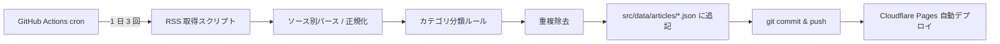

# EduWatch JP PRD v1.0

> サイト名・ブランド名は **EduWatch JP**、リポジトリ名・技術的呼称は `edu-watch`。本ドキュメントでは原則ブランド名を使い、パス・リポジトリ・GitHub Actions 等を指す時のみ内部呼称を使う。

**作成日**: 2026-04-23
**v1.0 承認日**: 2026-04-24
**作成者**: 伊差川隼人
**ステータス**: 承認済み(Sprint 1 着手可)

---

## 1. プロジェクト概要

### 1.1 名称

- **サイト名・ブランド名**: **EduWatch JP**(エデュウォッチ・ジェイピー)
- **リポジトリ名・技術的呼称**: `edu-watch`

### 1.2 ドメイン

`news.edu-evidence.org`(edu-evidence.org のサブドメイン)

### 1.3 一言で何か

**「日本の小学校教員・保護者に向けた、教育ニュース + 研究発信のキュレーションサイト」**

文科省・国立教育政策研究所・主要新聞の教育面・海外研究機関(EEF / OECD 等)から、教育実務に関わる情報を自動収集し、エビデンス視点で整理して毎日配信する。週 1 回、編集者による「今週のハイライト(論点整理付き)」を金曜朝に公開する。

### 1.4 姉妹サイトとの関係

| サイト | 役割 | 更新頻度 |
|---|---|---|
| [edu-evidence.org](https://edu-evidence.org) | 指導法・政策のエビデンスを体系的に整理する「ストック型」ポータル | 週次以下(じっくり) |
| **edu-watch**(本サイト) | 教育ニュース・研究発信を時系列で追う「フロー型」ウォッチ | 日次(自動) + 週次(編集) |

両サイトは **信頼と中立性を資産とする非営利ドメイン** として運用し、マネタイズは別ブランド(将来の教員業務支援 SaaS)に分離する。

---

## 2. 背景と目的

### 2.1 解決したい課題

日本の教育実務者(教員・保護者)が置かれている情報環境の課題:

1. **一次情報が届きにくい** — 文科省や国立教育政策研究所の発表は公式サイトで公開されているが、教員が日常業務の中で直接アクセスすることは稀。結果、SNS や大手メディアの単純化された報道で情報が届くことになる。
2. **海外研究の紹介が遅い・歪みがある** — EEF Toolkit / OECD の報告書が出ても、日本語の速報的紹介はほぼない。あっても商業メディアのキャッチーな切り取りが中心。
3. **研究者の個人発信が分散している** — X / note / 個人ブログでの有益な発信が埋もれがち。
4. **ニュースの流量を捌けない** — 毎日流れてくるニュースを「どれが実務に関わるのか」「どれが単なる話題か」を判断するコストが高い。

### 2.2 edu-watch がやること

- **一次情報を優先収集** — 文科省・国研・OECD・EEF を主軸にした自動収集
- **エビデンス視点でのタグ付け** — edu-evidence の分類体系(いじめ / 不登校 / ICT / 政策 等)を継承
- **週次ダイジェストで論点整理** — 1 週間のニュースから「これは覚えておくべき」を人手で選別し、背景・関連エビデンスにリンク
- **edu-evidence との相互リンク** — ニュースを読んだ読者が、関連する戦略ページやコラムに自然に遷移できる動線

### 2.3 やらないこと

- **速報性の追求** — ミリ秒単位の速報メディアにはならない。一次情報の確認と編集品質を優先
- **SNS での炎上に加担する切り取り** — タイトルの煽りや一面的な批判は避ける
- **授業実践の具体ノウハウ** — それは edu-evidence(体系) や将来の SaaS(ツール) の領域
- **広告 / アフィリエイト** — マネタイズは別ブランドで行う

---

## 3. ターゲット読者

### 3.1 プライマリ読者

- **小・中学校の現場教員**(20〜50 代)
- **保護者**(小・中学校の子どもを持つ 30〜50 代)

### 3.2 セカンダリ読者

- 管理職(校長・教頭)、指導主事
- 教育研究者・大学院生
- 教育系ライター・記者

### 3.3 読者のニーズ

| ニーズ | 提供する体験 |
|---|---|
| 一次情報に触れたい | 文科省・国研の発表を元リンクと共に要約 |
| 情報の取捨選択を楽にしたい | タグ付け + カテゴリ分類 + 週次ハイライト |
| エビデンスの裏付けを知りたい | edu-evidence の関連ページへ相互リンク |
| 短時間で網羅したい | 1 行要約 + 金曜朝のダイジェスト |

---

## 4. 価値提案(プロダクトのコア)

### 4.1 独自性

> **「一次情報を、エビデンスの視点で、中立に、速く届ける」**

他の教育ニュースメディアにない点:

1. **一次情報アクセスの簡便化** — 文科省 / 国研 / OECD / EEF 等の元資料へのリンクを最優先で掲載
2. **エビデンス観点の論点整理** — 週次ダイジェストでは「研究では何が分かっているか」を edu-evidence と連動して提示
3. **商業的動機がない** — 広告 / アフィリエイト / ステマ的紹介なし。信頼を最優先
4. **自動と人手のハイブリッド** — 日次は自動でスピーディ、週次は編集者の判断で品質担保

### 4.2 差別化ポイント(既存媒体との比較)

| 媒体 | 強み | 弱み(edu-watch が補う) |
|---|---|---|
| 朝日 EduA / 教育新聞 | 記者による深掘り記事 | 商業メディアのため中立性への疑問、有料壁 |
| 文科省公式サイト | 一次情報そのもの | 導線が悪く教員/保護者には届きにくい |
| SNS(X) | スピード、研究者の発信 | 情報の質がバラバラ、文脈を失いやすい |
| edu-evidence | 体系化された指導法エビデンス | 速報性なし |

edu-watch = **一次情報 + エビデンス視点 + スピード + 中立性** の組み合わせを単独で提供する。

---

## 5. スコープ

### 5.1 MVP(Phase 1)

**目標**: 自動収集 → 自動タグ付け → 日次公開を回す最小プロダクトを立ち上げる。

| 機能 | 実装方式 |
|---|---|
| 日次 RSS 収集 | GitHub Actions cron(1 日 3 回) |
| 記事タイトル・要約(1 行)・元リンク・カテゴリの保存 | リポジトリ内 JSON + Astro 静的生成 |
| カテゴリ分類 | ルールベース(キーワードマッチ) |
| トップページ(最新記事一覧) | Astro ページ |
| カテゴリページ(いじめ / 不登校 / ICT / 政策 など) | Astro ページ |
| 個別記事ページ | 元記事への外部リンクに留め、内部にはサマリーと edu-evidence 関連リンクのみ |
| 週次ハイライト(人手編集) | マークダウンで手書き、金曜朝公開 |
| RSS フィード配信 | Astro の RSS プラグイン |
| 検索 | Pagefind(edu-evidence と同じ) |
| サイトナビゲーションから edu-evidence への導線 | ヘッダー・フッターで相互リンク |

**対象ソース(MVP 時点、3 層構成)**:

edu-watch は「一次情報を、エビデンスの視点で、中立に、速く届ける」という価値提案のため、ソースを **3 層** に分けて扱う。それぞれ日常運用での位置付けが異なる:

### 第 1 層 — 一次情報(日次 自動収集)

- 文部科学省(新着情報 RSS / お知らせ)
- 国立教育政策研究所(新着)
- 中央教育審議会(審議情報)
- OECD Education and Skills(英語、要約は日本語化)
- Education Endowment Foundation(EEF Blog / Publications)

### 第 2 層 — 主要メディア 教育面(日次 自動収集)

- 朝日新聞 EduA
- 毎日新聞 教育面
- 読売新聞 こどもと教育
- 共同通信 教育
- 日経 教育(RSS 取得可否は要調査)

Yahoo ニュースは **元記事の配信プラットフォーム** であり、直接の収集対象にはしない(元ソースをそのまま追う設計)。

### 第 3 層 — 話題性シグナル(週次 編集者参照のみ、自動収集はしない)

- Yahoo ニューストピックス 教育カテゴリ(過去 1 週間を手動で一覧)
- Google Trends(教育関連キーワード)

目的は「今、教員・保護者の間で何が話題になっているか」の把握。**収集対象ではなく、金曜朝の週次ダイジェスト編集時の参考指標** として扱う。話題になっている案件があれば、一次資料に遡って確認した上でダイジェストに取り上げるか判断する。

### 本 3 層構成の意図

- 一次情報を素通りしない(Yahoo など配信プラットフォームを直接ソース化しない)
- 煽りタイトルや恣意的編集に巻き込まれない(元記事を直接追う)
- 話題性は無視しない(第 3 層を編集判断の参考に)
- 読者への透明性(なぜこの話題を今取り上げたかを週次ダイジェストで明示)

### 5.2 Phase 2

**目標**: 付加価値を高める。

- **AI による 1 行要約の自動生成**(現 MVP はタイトルのみ、または手動要約。Phase 2 で Claude API 等で自動化)
- **関連タグのサジェスト精度向上**(機械学習ベース or LLM 分類)
- **ユーザーのお気に入り / ブックマーク機能**(ローカルストレージで実装、アカウント不要)
- **メールマガジン配信**(週次ダイジェストをメールで届ける、Cloudflare Workers + 外部メール API)
- **研究者発信ウォッチ**(許諾を得た研究者の note / ブログ / X を追加ソース化)

### 5.3 Phase 3

**目標**: コミュニティ・エコシステム化。

- **読者投稿型のコメント(控えめに)**(例: 「この記事、学校ではこう議論された」という一言メモ)
- **自治体・各教委の発信追加**
- **英語版ミラー**(海外の教育研究者・JICA 等向け)
- **API 公開**(他の教員向けツールからの利用を想定)

---

## 6. 編集ポリシー(継承 + 拡張)

### 6.1 edu-evidence のルールを継承

- **Rule 1.1 正確性最優先** — 数値・出典は一次資料で検証
- **Rule 1.6 学校と家庭の役割境界を意識** — 教員のみの責任として語らない
- **Rule 1.2a 未読文献の分離** — 未読書籍・未読論文を「推奨」扱いしない
- **Rule 4 Public 文書の書き方** — 主観・煽り・自己言及を排除

### 6.2 edu-watch 固有のポリシー

- **一次情報リンクを必ず冒頭に** — 元記事 / 元資料へのリンクを 1 行目に配置
- **タイトルの編集は行わない**(原則) — 媒体側のタイトルをそのまま掲載。恣意的なリライトはしない
- **要約は機械的に**(MVP フェーズ) — 人手によるバイアスを避けるため、自動要約または本文冒頭 N 文字のみ
- **編集者の意見は週次ダイジェストに限定** — 日次記事では意見を付加せず、週次では明示的に「編集者より」として分離

### 6.3 掲載しない基準

- 記事タイトル / 内容が誹謗中傷・デマ・差別的な場合
- 元ソースが信頼できない場合(著者不明 / 一次資料なしの主張 / 広告目的)
- 内容が教育実務と無関係(政治ゴシップ、娯楽ニュース等)
- 重大事件の被害者特定につながる情報

---

## 7. 情報アーキテクチャ・ページ構成

### 7.1 サイトマップ(MVP)

```
edu-watch (news.edu-evidence.org)
├── / (トップページ: 最新記事一覧、最新ダイジェスト、カテゴリ入口)
├── /articles/ (全記事アーカイブ、日付降順)
├── /articles/[slug] (個別記事ページ → ほぼ元記事への外部リンク + edu-evidence 関連)
├── /categories/ (カテゴリ一覧)
├── /categories/[category] (カテゴリ別記事一覧: いじめ/不登校/ICT/政策/研究/国際 等)
├── /tags/[tag] (タグ別記事一覧)
├── /digest/ (週次ダイジェストアーカイブ)
├── /digest/[yyyy-mm-dd] (個別週次ダイジェスト)
├── /sources/ (収集ソース一覧 + 透明性ページ)
├── /about/ (edu-watch について、編集ポリシー)
├── /rss.xml (RSS フィード)
└── /sitemap.xml
```

### 7.2 トップページの構成(MVP)

1. **ヘッダー**: ロゴ / edu-evidence へのリンク / サイト内検索
2. **ヒーロー**: 今日のハイライト(1〜3 記事、編集者が重要と判断したもの、または最新順)
3. **週次ダイジェスト最新版**: 金曜に更新される固定ブロック
4. **カテゴリショートカット**: いじめ / 不登校 / ICT / 政策 / 研究 / 国際 の 6 カード
5. **最新記事タイムライン**: 過去 7 日分、タイトル + 要約 + 元リンク + タグ
6. **edu-evidence への導線**: 「エビデンスの体系を知る →」
7. **フッター**: sources / about / RSS / 運営者情報

### 7.3 カテゴリ体系(MVP)

edu-evidence の tags を継承する。

- いじめ
- 不登校
- ICT / GIGA
- 政策・制度
- 研究・エビデンス
- 国際・海外
- 教員・働き方
- その他

Phase 2 以降でサブカテゴリ追加を検討。

---

## 8. 技術スタック

### 8.1 フロントエンド

edu-evidence と完全に揃える。共通運用・共通デプロイ・共通知識で回せる。

| 技術 | バージョン |
|---|---|
| Astro | 6.x |
| React | 19.x |
| TypeScript | 5.x |
| Tailwind | 4.x |
| Node.js | 24.15.0(mise 管理) |
| パッケージマネージャ | npm |

### 8.2 インフラ

| 用途 | 選定 |
|---|---|
| ホスティング | Cloudflare Pages |
| ドメイン | news.edu-evidence.org(CNAME) |
| CI/CD | GitHub Actions(自動収集 + デプロイ) |
| データストア(MVP) | リポジトリ内 JSON(src/data/articles/*.json)|
| データストア(Phase 2+) | Cloudflare D1 または KV(判断保留) |
| 検索 | Pagefind(静的インデックス) |
| 画像 | Cloudflare Images or Astro 標準 |

### 8.3 継承する共通資産(edu-evidence からコピー)

MVP 時点では **コピー持ち込み** で開始。半年運用後に共通化するか判断。

- `src/layouts/Layout.astro`(ヘッダー・フッター・用語ツールチップ JS)
- `src/data/glossary.ts`(用語集)
- `src/styles/global.css`(デザインシステム / トークン)
- `src/lib/og-image.ts`(OG 画像生成)
- `src/plugins/remark-glossary.mjs`(用語自動リンク)
- `public/_headers`(セキュリティヘッダー)

### 8.4 共有しないもの(サイト固有)

- コンテンツ(strategies / columns は edu-evidence のみ、articles / digest は edu-watch のみ)
- スキーマ(content.config.ts はサイト独自)
- ページ構成

---

## 9. 運用フロー(自動化)

### 9.1 日次パイプライン



- **cron 時刻**: 07:00 / 13:00 / 19:00 JST(3 回/日)
- **失敗時**: GitHub Actions の失敗通知 + リトライ 3 回
- **重複除去**: URL ハッシュ + タイトル類似度

### 9.2 週次パイプライン(人手)

- **金曜朝(6:00 JST)に編集者通知**: GitHub Actions で「今週の記事リスト」を Markdown で自動生成し、PR として作成
- **編集者(伊差川)が PR レビュー**:
  1. 過去 1 週間の記事を確認し、ダイジェストに取り上げる候補を 3〜5 件に絞る
  2. **第 3 層(Yahoo ニューストピックス教育カテゴリ + Google Trends)を手動で一瞥** し、一次情報層・主要メディア層で見落としている話題が無いかチェック
  3. 話題になっている案件があれば、該当する一次資料・主要メディア記事に遡って確認
  4. ダイジェスト本文を追記(各記事に「なぜ今これを取り上げるか」の 1 行コメント)
- **マージでデプロイ**

### 9.3 X(Twitter)運用(週次ダイジェスト連動)

- **アカウント構成**: 姉妹サイトと統一して `@edu_evidence` 1 アカウントで運用(別アカウント分離はしない)
- **日次記事は X にポストしない**(連投によるノイズ化回避)
- **週次ダイジェスト公開時のみ**、1 本のスレッドでポスト:
  - 先頭ツイート: 「今週の教育ウォッチ」+ 主要カテゴリ(いじめ / 不登校 / ICT / 政策など)のハイライト 1 行
  - 続くツイート: カテゴリ別に 3〜5 件、各記事の 1 行要約 + リンク
  - 末尾ツイート: 週次ダイジェストページへのリンク
- **投稿方法**: GitHub Actions から X API v2 で自動投稿(金曜朝 7:00 JST)
- **コンテンツ識別**: ポストに `🔔 edu-watch` プレフィックスを付け、edu-evidence の通常コラム投稿(`📚 edu-evidence`)と区別
- **エンゲージメント対応**: リプライは編集者が週 1 回まとめて対応(即レスは原則しない、速報メディア化を避ける)

### 9.4 監視

- Cloudflare Pages のデプロイ失敗通知
- RSS 取得の 404 / 構造変更 → Actions ログ通知
- X API の投稿失敗 → Actions ログ通知
- 週次で「取得ソース別記事数」レポートを自動生成(極端な減少 = ソース側の変更疑い)

---

## 10. デプロイ・ドメイン設定

### 10.1 ドメイン

- **news.edu-evidence.org**(Cloudflare Registrar で管理中の edu-evidence.org のサブドメイン)
- Cloudflare Pages カスタムドメイン設定で CNAME 追加

### 10.2 メール運用(Cloudflare Email Routing、無料)

edu-evidence.org のドメインメールとして以下 3 エイリアスを設定し、すべて運営専用 Gmail `eduevidence.jp@gmail.com` に転送する(個人 Gmail `harnet0119@gmail.com` とは分離):

- `contact@edu-evidence.org` — 読者・問い合わせ窓口(両サイト共通)
- `news@edu-evidence.org` — edu-watch 関連(RSS 管理・ソース連絡・ダイジェスト配信問い合わせ)
- `notify@edu-evidence.org` — サービス登録用(X API、GitHub Sponsors、Cloudflare 管理、その他外部サービス)

運用上の補足:

- **受信仕分け**: Gmail のフィルタで `to:contact@` / `to:news@` / `to:notify@` の 3 レーンに自動ラベル付け
- **気付きやすさ**: 必要に応じて `eduevidence.jp@gmail.com` から `harnet0119@gmail.com` への "重要連絡のみ二次転送" を Gmail 側ルールで設定(初期はオフで OK)
- **送信**: Gmail の「別名送信」で `contact@edu-evidence.org` 等に偽装(SPF / DKIM 整備済み)
- **将来の移行**: 問い合わせが月 20 通を超えた段階、または SaaS ブランド運営負荷が増えた段階で Google Workspace Business Starter($6/月)への移行を検討

### 10.2.1 運用メールの分離方針

- **運営ブランド(edu-evidence / edu-watch)**: `eduevidence.jp@gmail.com`(専用)
- **個人**: `harnet0119@gmail.com`(プライベートに近い連絡用途に限定)
- **SaaS(将来別ブランド)**: 別途新規 Gmail を取得して 3 系統分離

この分離により、将来の運営協力者追加時の引き継ぎ(専用 Gmail のパスワード共有のみで完了)と、生活とのバランス(個人メールの汚染回避)を両立する。

### 10.3 CSP / セキュリティヘッダー

edu-evidence の `public/_headers` を基礎とし、edu-watch 固有の外部リソース(RSS 取得先の favicon 等)があれば追加。

### 10.4 robots.txt / sitemap

- robots.txt: 検索エンジンインデックスを許可、LLM クローラーは個別に判断(edu-evidence と同じ方針)
- sitemap.xml: Astro sitemap プラグインで自動生成

---

## 11. マネタイズ方針

### 11.1 MVP〜Phase 3 の方針

**マネタイズは行わない。**

理由:

- edu-watch の核となる価値は「中立性」と「信頼」。広告 / アフィリエイト / 有料プランはすべて中立性を損なう方向に作用する
- 運用コストは Cloudflare Pages の無料枠 + GitHub Actions の無料枠で十分賄える(現時点の試算)

### 11.2 将来の収益源

- **教員業務支援 SaaS(別ブランド / 別ドメイン / 別リポジトリ)** — 授業ではなく通常業務(事務・所見・保護者対応など)を支援するツールとして開発予定。edu-evidence / edu-watch で築いた信頼を認知の土台にしつつ、商材は完全分離
- **GitHub Sponsors / 研究助成金**(edu-evidence 側で運用、余剰分を edu-watch 運営費に回す)

### 11.3 ブランド境界の明示

edu-watch の footer / about では以下を明記する:

- 本サイトは広告を掲載しない
- 運営者は別途、教員向け業務支援ツールを開発している
- ただしそのツールが edu-watch 記事内で優遇紹介されることはない(透明性の担保)

---

## 12. 成功指標(KPI)

### 12.1 MVP 期間(1〜3 ヶ月)

| 指標 | 目標 |
|---|---|
| 日次記事数 | 5〜15 記事/日 |
| 週次ダイジェスト公開率 | 100%(毎週金曜) |
| ソース取得失敗率 | <5% |
| サイト訪問者数(月間 UU) | 500〜2000 |
| 平均滞在時間 | 1 分以上 |

### 12.2 Phase 2 期間(3〜12 ヶ月)

| 指標 | 目標 |
|---|---|
| 月間 UU | 5,000〜20,000 |
| RSS / メール購読者 | 200 名以上 |
| edu-evidence へのクロストラフィック | 訪問者の 15% 以上 |
| 検索流入比率 | 40% 以上 |

### 12.3 測定方法

- Cloudflare Web Analytics(クッキーレス、プライバシー重視)
- GitHub Actions で取得ソース別記事数の週次ログ

---

## 13. リスクと対策

| リスク | 影響度 | 対策 |
|---|---|---|
| RSS 構造変更でパースエラー | 中 | ソース別のパーサーモジュール化、エラー通知 |
| 著作権侵害の懸念(タイトル・要約の利用) | 中 | タイトルはそのまま引用(引用の要件を満たす)、本文は要約のみ、元リンクを必ず掲載。判例上問題ない運用 |
| 広告を出さないことによる収益欠如 | 低 | 運用コストを極小化(無料枠で回す)、収益は別ブランドで |
| edu-evidence への悪影響(信頼毀損) | 高 | 編集ポリシーを厳守、掲載しない基準を明文化、重大事件の被害者特定につながる情報を排除 |
| 運営者(1 人)のリソース枯渇 | 高 | 自動化比率を最大化、週次ダイジェストの負荷を 30 分以内に収める設計 |
| 一次情報以外に依存するソースの質低下 | 中 | MVP は文科省 / 国研 / OECD / EEF の 4 本柱、他は Phase 2 で慎重に追加 |

---

## 14. ロードマップ

### Sprint 0 (本 PRD 作成 〜 承認): ~ 1 週間

- PRD ドラフト(本ドキュメント)
- 要件確定・レビュー
- PRD v1.0 承認

### Sprint 1 (基盤構築): 2 週間

- [ ] GitHub リポジトリ作成(`Hayato-Isagawa/edu-watch`)
- [ ] Astro プロジェクト初期化(edu-evidence から最小限コピー)
- [ ] `.tool-versions` / `.mise.toml` / `engines.node` 設定
- [ ] Cloudflare Pages プロジェクト作成
- [ ] `news.edu-evidence.org` CNAME 設定
- [ ] 空のトップページで公開確認

### Sprint 2 (データパイプライン): 2 週間

- [ ] RSS 取得スクリプト(TypeScript / Node)
- [ ] ソース別パーサー(文科省 / 国研 / OECD / EEF)
- [ ] カテゴリ分類ルール(キーワードベース)
- [ ] `src/data/articles/*.json` スキーマ定義
- [ ] GitHub Actions cron 設定(07:00 / 13:00 / 19:00 JST)
- [ ] 重複除去ロジック

### Sprint 3 (フロント実装): 2 週間

- [ ] トップページ(ヒーロー + カテゴリショートカット + 最新記事)
- [ ] カテゴリページ
- [ ] 個別記事ページ(元リンク + edu-evidence 関連)
- [ ] 検索(Pagefind)
- [ ] RSS フィード出力
- [ ] サイトナビゲーション(edu-evidence との相互リンク)

### Sprint 4 (週次ダイジェスト + 仕上げ): 1 週間

- [ ] 週次 PR 自動生成スクリプト
- [ ] ダイジェストページ + 個別ダイジェストページ
- [ ] About / Sources ページ
- [ ] OG 画像生成(edu-evidence 流用)
- [ ] CSP / セキュリティヘッダー
- [ ] 公開前レビュー → ソフトローンチ

### ソフトローンチ: MVP 公開 + 1〜3 ヶ月観察

- edu-evidence からの導線確認
- 記事収集の安定性確認
- 週次ダイジェスト運用の定着
- KPI 測定

### Phase 2 着手判断: 6 ヶ月時点

- MVP の KPI 達成度をレビューし、Phase 2 スコープの優先順位を再設計

---

## 15. 未確定事項 / オープンな質問

以下は PRD v1.0 の段階では決め切らず、Sprint 1 前に別途決定する。

1. **データストアを JSON ファイルで押し切るか、早期に D1/KV に移すか**
   - MVP は JSON で十分だが、記事数が 10,000 超えたら静的生成のビルド時間が問題になる可能性
2. **AI 要約の導入タイミング**
   - MVP はタイトルのみ、Phase 2 で Claude API を入れるのが有力
3. **メール配信の実装方式**
   - Phase 2 で検討。Resend / Buttondown / 自前 Cloudflare Workers のどれを使うか
4. **研究者発信の追加時、許諾取得フロー**
   - Phase 2 で方針策定(クリエイティブ・コモンズ準拠のフィードのみ扱う、等)
5. **過去記事のアーカイブ方針**
   - 1 年以上前の記事はトップから外すが、カテゴリページには残すか

---

## 16. 承認

- [x] 本 PRD ドラフトを v0.1 として提出(2026-04-23)
- [x] レビュー後、以下の決定事項を反映して v1.0 に昇格(2026-04-24)
  - Yahoo ニュースの扱い: 3 層構成(一次情報・主要メディア・話題性シグナル)に整理。Yahoo は第 3 層として週次編集時の参考のみ
  - X(Twitter)運用: `@edu_evidence` 統一運用、日次 は投稿せず週次ダイジェスト公開時に 1 スレッド
  - メール: Cloudflare Email Routing で `contact` / `news` / `notify` の 3 エイリアス、個人 Gmail 転送
  - マネタイズ: edu-watch 本体は非営利のまま、収益化は別ブランドの教員業務支援 SaaS(授業ではなく通常業務向け)で実施
- [x] v1.0 承認 — **Sprint 1 着手可**
